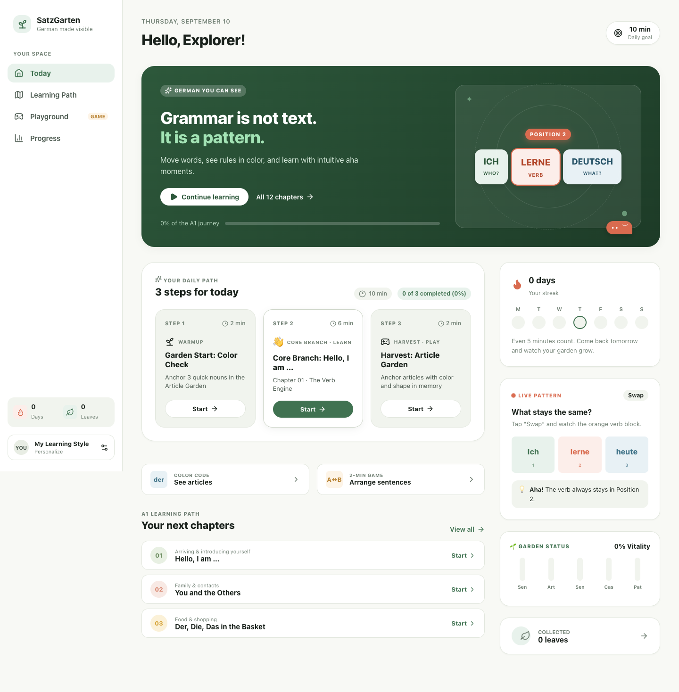

# SatzGarten

A visual, playful German A1 grammar learning app for personal study. The curriculum follows CEFR A1 and the common progression of *Netzwerk neu A1*, while all explanations, examples, and exercises are original.



## Language

The interface, instructions, grammar explanations, hints, and feedback are in **English**. German sentences, vocabulary, and answer choices stay in **German**, with English translations beside examples. Browser auto-translation is disabled to prevent it from turning distinct German answers into identical English words.

## Run locally

```bash
npm install
npm run dev
```

Open the local URL shown by Vite (usually `http://localhost:5173`).

## Production build

```bash
npm run build
npm run preview
```

## Included

- 12 A1 chapters and 60+ grammar topic markers
- Interactive visual grammar models
- German text-to-speech examples
- Choice, fill-in, and sentence-building exercises
- Article Garden, Blitz Mix, and Sentence Workshop games
- Four-step visual learning-style calibration
- Confidence input after exercises
- Adaptive daily plan based on accuracy, response time, recent errors, confidence, and preferred learning format
- Local learning fingerprint and progress dashboard
- Browser-local persistence; learning data stays on the device
- Responsive desktop/mobile UI and keyboard-friendly controls

## Main files

- `src/data/curriculum.ts` — curriculum, examples, visual states, and exercises
- `src/hooks/useLearningState.ts` — progress persistence and adaptive recommendation logic
- `src/components/LessonView.tsx` — lesson visualization, examples, audio, and practice
- `src/components/PracticeHub.tsx` — mini-games
- `src/components/LearningFingerprintCard.tsx` — adaptive learning insights

## Optional live AI tutor

On each chapter’s **Examples** tab, the tutor can offer simpler explanations, fresh examples, and a small challenge. English explanations with German examples are the default.

1. Copy `.env.example` to `.env.local`.
2. Set `AI_PROVIDER` (`gemini` or `openai`), `AI_MODEL` (an actual model ID available to your API account), and `AI_API_KEY`.
3. Restart `npm run dev`. The same local API also works with `npm run preview`.
4. Explicitly consent in the tutor panel before sending a request.

Keys stay server-side. Never prefix a secret with `VITE_`. The endpoint allows localhost only, checks Origin, limits input size and request rate, and times out provider calls. Do not expose this personal server publicly without authentication. Development CLI subscriptions and model nicknames do not automatically provide API access.

Only the current question, chapter explanation/examples, selected visual format, aggregate chapter answer counts, and an uncertainty flag are sent. Names and full history are excluded. Provider privacy policies still apply. Generated answers are untrusted advice, not grading. Real provider connectivity requires your credentials; automated tests use mock provider responses.

A static `dist/` deployment runs the lessons but **not** the AI endpoint. The in-app adaptive plan is a transparent local heuristic, not an LLM or a scientifically validated learning-style diagnosis. Format use and task accuracy are clues, not proof that one modality is best. There is no account, cloud sync, or service-worker offline installation yet.

## Verification

Requires Node.js 22.6+ (Node 24+ recommended).

```bash
npm run build
npm run lint
npm test
```

Optional real-browser smoke test (with the local dev server running):

```bash
python3 -m pip install playwright
python3 -m playwright install chromium
python3 tests/browser_smoke.py
```

## Curriculum scope

This first version contains 12 visual chapters, 36 checked exercises and an article mini-game deck. It covers the main A1 grammar families, but three exercises per chapter are an introduction—not exhaustive mastery testing of every topic tag. Some comparison/adjective material is an A1-to-A2 bridge. Exact chapter-by-chapter alignment with your particular *Netzwerk neu* edition has not been verified; its contents page can be used for a future detailed mapping.

## Notes

This is an independent learning aid and is not affiliated with or endorsed by Klett or the *Netzwerk neu* authors/publishers. It does not reproduce textbook pages or exercises.
